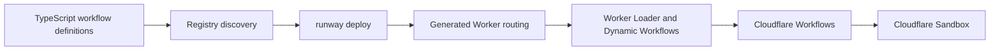

# Runway Vision

Runway is TypeScript-first workflow infrastructure for repository automation, CI/CD, custom triggers, scheduled work, webhooks, and agent-native execution on Cloudflare.

The product thesis is simple: teams should be able to express operational work as typed TypeScript workflows, deploy those workflows with one command, and let Cloudflare own durable execution, routing, schedules, isolation, and scale. A repository workflow, a release check, a webhook automation, and an agent review should all be composed from the same small set of primitives instead of from separate configuration systems.

## Product Direction

Runway is built for engineers who want programmable automation close to their codebase:

- Repository maintainers who want typed checks, reviews, release tasks, and scheduled maintenance.
- Platform teams who want Cloudflare-native automation without hand-writing Worker routing and Workflow glue.
- Product engineers who want secure webhooks and background work with durable retries and replay.
- Agent builders who want coding agents to run inside isolated Cloudflare Sandbox environments as part of a durable workflow.

Runway is not trying to hide that these are workflows. The core API remains `workflow({ id, secrets?, trigger }).handler(...)`, and future capabilities should compose around that primitive rather than introduce a second authoring model.

## Primitive Model

Runway workflows are code-first declarations discovered from `.runway/workflows/**/*.ts`. A workflow has an id, optional declared secrets, one trigger, and a handler. The handler receives typed context primitives:

- `ctx.step` for durable, memoized work with explicit idempotency keys.
- `ctx.ai` for durable OpenRouter chat completions.
- `ctx.agent` for Pi-powered agent runs in Cloudflare Sandbox.
- `ctx.sandbox` for custom isolated command execution.
- `ctx.sleep` for durable waits.
- `ctx.secrets` and `ctx.env` for declared secret values and advanced Cloudflare runtime access.

Triggers are explicit. `cron(...)` schedules workflows from Cloudflare Workers schedules, and `webhook(...)` provides HMAC-verified POST routes with optional timestamp, schema, and filter gates. There is no default public start endpoint.

## Cloudflare-Native Architecture

Cloudflare is the only backend target. Runway should continue to translate TypeScript workflow definitions into Cloudflare resources rather than introduce a backend abstraction layer.



The active deployment path is one reconciliation command: `runway deploy`. It discovers workflows, generates one orchestration Worker for the repository, configures webhook and cron routing, binds a matching repo-scoped Dynamic Workflow resource, loads workflow modules through Worker Loader and Dynamic Workflows, wires schedules, and provides Cloudflare Sandbox access for `ctx.agent` and `ctx.sandbox`.

Runway does not deploy one Worker per workflow. A repository's workflows share one small orchestration Worker and one Dynamic Workflow resource; individual workflow code is loaded through Cloudflare Worker Loader and Dynamic Workers.

The shared resource name is deterministic from deploy inputs: `RUNWAY_SCRIPT_NAME` first, then `package.json` name, then the current directory basename. Runway normalizes names to lowercase hyphen slugs, rejects names longer than the workers.dev DNS label limit, uses explicit overrides directly, and prefixes package or directory fallback slugs as `runway-<repo-slug>` unless they are `runway` or start with `runway-`. Repositories that can collide after normalization or deploy from unstable worktree paths should pin `RUNWAY_SCRIPT_NAME`.

## Agent-Native Execution

Agents are a native workflow primitive, not an external sidecar. `ctx.agent` runs inside a durable workflow step, writes optional files into a Cloudflare Sandbox workspace, executes the configured Pi command, and returns stdout to the workflow. `ctx.sandbox` exposes the same isolated execution environment for custom commands.

This model lets repository automation combine typed triggers, durable steps, plain repo Worker secrets, and sandboxed agents in one handler. Future agent features should preserve that shape: agents should be invoked from workflows, run with explicit inputs and secrets, and remain durable through Cloudflare Workflows.

## CI/CD Positioning

Runway is primitive-first infrastructure for CI/CD-style automation, not a clone of another system. The current product direction is to make repository workflows programmable in TypeScript: release checks, dependency maintenance, issue triage, scheduled audits, webhook fan-out, and agent reviews should be ordinary workflows deployed to Cloudflare.

The immediate foundation is the current API surface, not a broad CI feature matrix. CI/CD features should arrive as workflow-composable capabilities that keep the TypeScript authoring model, Cloudflare runtime, and small primitive set intact.

## Example

```ts
import { cron, workflow } from "runway";

export default workflow({
  id: "release-check",
  secrets: ["OPENROUTER_API_KEY"],
  trigger: () => cron("0 * * * *"),
}).handler(async (ctx, event) => {
  const report = await ctx.agent("review", {
    args: ["review the repository and report release blockers"],
    env: { OPENROUTER_API_KEY: ctx.secrets.OPENROUTER_API_KEY },
    timeoutMs: 300_000,
  });

  await ctx.step("publish", async () => {
    await publishReleaseCheck({ report, scheduledTime: event.scheduledTime });
  });
});
```

This is CI/CD-style repository automation expressed with the existing `workflow`, `cron`, `ctx.agent`, secrets, and durable step APIs.

## Simplicity Constraints

Runway should stay small enough that users can understand the end-to-end path:

- One authoring model: TypeScript workflow definitions in repository files.
- One deployment path: `runway deploy` reconciles Cloudflare resources.
- One active package boundary: `packages/runway` provides the SDK and CLI.
- One backend target: Cloudflare Workers, Workflows, Dynamic Workflows, Worker Loader, schedules, Sandbox, and Containers.
- Explicit primitives over hidden behavior: triggers, secrets, steps, agents, sandbox calls, and sleeps are visible in code.

## Non-Goals

The cleanup foundation does not add or promise these as current scope:

- Additional authoring aliases for the core workflow primitive.
- A second declarative config format.
- Compatibility with external workflow configuration languages.
- Broad source-control platform feature sets that would expand the current primitive surface.
- A non-Cloudflare backend.
- A new agent runtime framework replacing `ctx.agent` and Cloudflare Sandbox.

Future feature work should update this vision when the product deliberately expands beyond these constraints.
